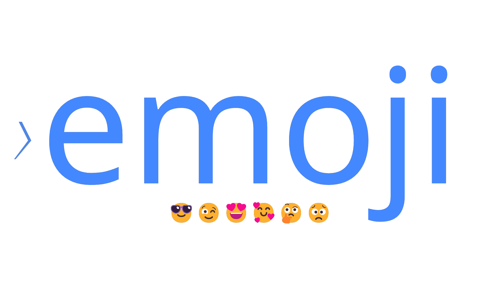

<div align='center'>

<a href='https://www.powershellgallery.com/packages/emoji/'>

</a>
<br/>
<a href='https://github.com/sponsors/StartAutomating'>❤️</a>
<a href='https://github.com/StartAutomating/emoji/stargazers'>⭐</a>
</div>

# Emoji
⟩⚡PowerShell Emoji 😎😉😍🥰🤔😟

Emoji is a little PowerShell module to help you work with Emoji.

It is built from the Unicode Character Dataset, which includes ```.>{@(Import-Csv (Join-Path "$pwd" Data | Join-Path -ChildPath "AllNamedEmoji.csv")).Length}<.``` named symbols.

## Installing and Importing

Emoji is on the PowerShell Gallery.

You can install and import Emoji by using:

~~~PowerShell
Install-Module Emoji -Scope CurrentUser -Force
Import-Module Emoji
~~~

## Searching Emoji

Search-Emoji or Find-Emoji can be used to search loaded Emoji

~~~PowerShell
# Find all of the Emoji faces
Find-Emoji -Pattern "Face"
~~~

~~~PowerShell
# Search all emoji ending in cats and dogs
Search-Emoji -Pattern "(Cat|Dog)$"
~~~

~~~PowerShell
# Find all emoji grins
Find-Emoji -Pattern "*grin*" -Like
~~~